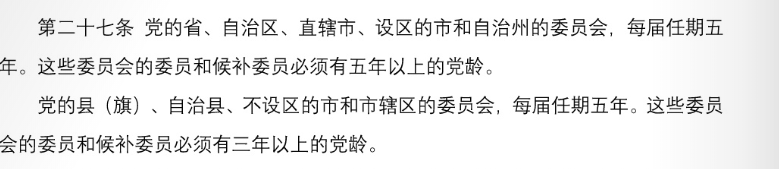
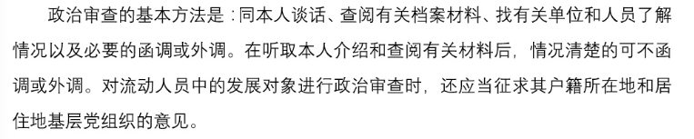
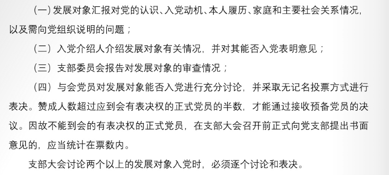
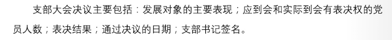
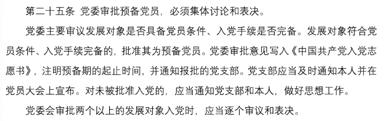

1. **中国共产党是中国工人阶级的先锋队，同时是中国人民和中华民族的先锋队，是中国特色社会主义事业的领导核心，代表中国先进生产力的发展要求，代表中国先进文化的前进方向，代表中国最广大人民的根本利益。党的最高理想和最终目标是实现共产主义。**
2. 中国共产党以马克思列宁主义、毛泽东思想、邓小平理论、“三个代表”重要思想、科学发展观、习近平新时代中国特色社会主义思想作为自己的行动指南。
3. **从理论和实践结合上系统回答了新时代坚持和发展什么样的中国特色社会主义、怎样坚持和发展中国特色社会主义这个重大时代课题，创立了习近平新时代中国特色社会主义思想。习近平新时代中国特色社会主义思想是对马克思列宁主义、毛泽东思想、邓小平理论、“三个代表”重要思想、科学发展观的继承和发展，是马克思主义中国化的最新成果，是党和人民实践经验和集体智慧的结晶，是中国特色社会主义理论体系的重要组成部分，是全党全国人民为实现中华民族伟大复兴而奋斗的行动指南，必须长期坚持并不断发展。**
4. **四个伟大**：伟大斗争、伟大工程、伟大事业、伟大梦想
5. **主要矛盾**：人民日益增长的美好生活需要和不平衡不充分的发展之间的矛盾。
6. **社会主义建设的根本任务**：进一步解放生产力、发展生产力，逐步实现社会主义现代化，并且为此而改革生产关系和上层建筑中不适应生产力发展的方面和环节。
7. **发展**是党执政兴国的第一要务。
8. 坚持**创新、协调、绿色、开发、共享**的发展理念。
9. **总的出发点和检验标准**：有利于发展社会主义社会的生产力；有利于增强社会主义国家的综合国力；有利于提高人民的生活水平。
10. **五位一体**：经济建设、政治建设、文化建设、社会建设、生态文明建设
11. **四个全面**：全面建成小康社会、全面深化改革、全面依法治国、全面从严治党
12. **两个一百年**：到建党一百年时，全面建成小康社会；到新中国成立一百年时，全面建成社会主义现代化强国
13. **社会主义初级阶段的基本路线**：领导和团结全国各族人民，以经济建设为中心，坚持四项基本原则，坚持改革开放，自力更生、艰苦创业，为把我国建设成为富强、民主、文明、和谐、美丽的社会主义现代化强国而奋斗。
14. **四项基本原则**：坚持社会主义道路、坚持人民民主专政、坚持中国共产党的领导、坚持马克思列宁主义毛泽东思想
15. 坚持四项基本原则是**立国之本**，坚持改革开放是**强国之路**
16. 毫不动摇的巩固和发展公有制经济，毫不动摇地鼓励、支持、引导非公有制经济发展。
17. 以**爱国主义**为核心的民族精神，以**改革创新**为核心的时代精神
18. **四有**：有理想、有道德、有文化、有纪律
19. 民主法治、公平正义、诚信友爱、充满活力、安定有序、人与自然和谐相处
20. 建设**资源节约型**、**环境友好型**社会
21. 建设一支**听党指挥、能打胜仗、作风优良**的人民军队
22. **互相尊重主权和领土完整；互不侵犯、互不干涉内政、平等互利、和平共处五项原则**
23. 坚持**立党为公、执政为民**
24. 建设**学习型、服务型、创新型**的马克思主义执政党
25. **五项基本要求**：
    1. 坚持党的基本路线
    2. 坚持解放思想、实事求是、与时俱进、求真务实
    3. 坚持全心全意为人民服务
    4. 坚持民主集中制
    5. 坚持从严管党治党
26. **党的思想路线**：一切从实际出发，理论联系实际，实事求是，在实践中检验真理和发展真理。
27. 党除了**工人阶级和最广大人民群众**的利益，没有自己特殊的利益
28. **最大政治优势**是密切联系群众，**执政后最大危险**是脱离群众；**党风问题，党和人民群众的联系问题**是关系党生死存亡的问题。
29. **群众路线**：一切为了群众，一切依靠群众，从群众中来到群众中去，把党的正确主张变为群众的自觉行动。
30. **民主集中制**是民主基础上的集中和集中指导下的民主相结合，是**党的根本组织原则**
31. **四个意识**：政治意识、大局意识、核心意识、看齐意识
32. **两个维护**：坚定维护习近平总书记党中央的核心、全党的核心地位；坚决维护党中央权威和集中统一领导
33. **党面临的考验**：执政考验、改革开放考验、市场经济考验、外部环境考验
34. **党面临的危险**：精神懈怠危险、能力不足危险、脱离群众危险、消极腐败危险
35. **中国共产党的领导是中国特色社会主义最本质的特征，是中国特色社会主义制度的最大优势。**
36. **党政军民学，东西南北中**，党是领导一切的
37. 坚持**科学执政、民主执政、依法执政**
38. 十八大指出建设中国特色社会主义，总任务是**实现社会主义现代化和中华民族伟大复兴**。

------

1. **年满十八岁的中国工人、农民、军人、知识分子和其他社会阶层的先进分子，承认党的纲领和章程，愿意参加党的一个组织并在其中积极工作、执行党的决议和按期交纳党费的，可以申请加入中国共产党。**
2. **党员的要求**：
    1. 中国共产党党员是中国工人阶级的有共产主义觉悟的先锋战士；
    2. 中国共产党党员必须全心全意为人民服务，不惜牺牲个人的一切，为实现共产主义奋斗终身；
    3. 中国共产党党员永远是劳动人民的普通一员。除了法律和政策规定范围内的个人利益和工作职权以外，所有共产党员都不得谋求任何私利和特权。
3. **党员的义务**：
	1. 认真学习马克思列宁主义、毛泽东思想、邓小平理论、“三个代表”重要思想、科学发展观、习近平新时代中国特色社会主义思想，学习党的路线、方针、政策和决议，学习党的基本知识，学习科学、文化、法律和业务知识，努力提高为人民服务的本领。
	2. 贯彻执行党的基本路线和各项方针、政策，带头参加改革开放和社会主义现代化建设，带动群众为经济发展和社会进步艰苦奋斗，在生产、工作、学习和社会生活中起先锋模范作用。
	3. 坚持党和人民的利益高于一切，个人利益服从党和人民的利益，吃苦在前，享受在后，克己奉公，多做贡献。
	4. 自觉遵守党的纪律，首先是党的政治纪律和政治规矩，模范遵守国家的法律法规，严格保守党和国家的秘密，执行党的决定，服从组织分配，积极完成党的任务。
	5. 维护党的团结和统一，对党忠诚老实、言行一致，坚决反对一切派别组织和小集团活动，反对阳奉阴违的两面派行为和一切阴谋诡计。
	6. 切实开展批评和自我批评，勇于揭露和纠正违反党的原则的言行和工作中的缺点错误，坚决同消极腐败现象作斗争。
	7. 密切联系群众，向群众宣传党的主张，遇事同群众商量，及时向党反映群众的意见和要求，维护群众的正当利益。
	8. 发扬社会主义新风尚，带头实践社会主义核心价值观和社会主义荣辱观，提倡共产主义道德，弘扬中华民族传统美德，为了保护国家和人民的利益，在一切困难和危险的时刻挺身而出，英勇斗争，不怕牺牲。
4. **党员的权利**：
	1. 参加党的有关会议，阅读党的有关文件，接受党的教育和培训。
	2. 在党的会议上和党报党刊上，参加关于党的政策问题的讨论。
	3. 对党的工作提出建议和倡议。
	4. 在党的会议上有根据地批评党的任何组织和任何党员，向党负责地揭发、检举党的任何组织和任何党员违法乱纪的事实，要求处分违法乱纪的党员，要求罢免或撤换不称职的干部。
	5. 行使表决权、选举权，有被选举权。
	6. 在党组织讨论决定对党员的党纪处分或作出鉴定时，本人有权参加和进行申辩，其他党员可以为他作证和辩护。
	7. 对党的决议和政策如有不同意见，在坚决执行的前提下，可以声明保留，并且可以把自己的意见向党的上级组织直至中央提出。
	8. 向党的上级组织直至中央提出请求、申诉和控告，并要求有关组织给以负责的答复。
5. 发展党员，必须把**政治标准**放在首位，经过党的支部，坚持**个别吸收的原则**
6. **两名正式党员**作介绍人
7. 预备党员的预备期为**一年**，预备党员的权利除了没有表决权、选举权和被选举权以外，也同正式党员一样。延长预备期不能超过**一年**；延长预备期或取消预备党员资格，都应当经**支部大会讨论通过和上级党组织批准**；预备党员的预备期，从支部大会通过他为预备党员之日算起，党员的党龄，从预备期满转为正式党员之日算起。
8.  党员没有正当理由，**连续六个月不参加党的组织生活，或不交纳党费，或不做党所分配的工作**，就被认为是自行脱党。

------

1. **民主集中制的基本原则**：
	1. 党员个人服从党的组织，少数服从多数，下级组织服从上级组织，全党各个组织和全体党员服从党的全国代表大会和中央委员会。
	2. 党的各级领导机关，除它们派出的代表机关和在非党组织中的党组外，都由选举产生。
	3. 党的最高领导机关，是党的全国代表大会和它所产生的中央委员会。党的地方各级领导机关，是党的地方各级代表大会和它们所产生的委员会。党的各级委员会向同级的代表大会负责并报告工作。
	4. 党的上级组织要经常听取下级组织和党员群众的意见，及时解决他们提出的问题。党的下级组织既要向上级组织请示和报告工作，又要独立负责地解决自己职责范围内的问题。上下级组织之间要互通情报、互相支持和互相监督。党的各级组织要按规定实行党务公开，使党员对党内事务有更多的了解和参与。
	5. 党的各级委员会实行集体领导和个人分工负责相结合的制度。凡属重大问题都要按照集体领导、民主集中、个别酝酿、会议决定的原则，由党的委员会集体讨论，作出决定；委员会成员要根据集体的决定和分工，切实履行自己的职责。
	6. 党禁止任何形式的个人崇拜。要保证党的领导人的活动处于党和人民的监督之下，同时维护一切代表党和人民利益的领导人的威信。
2. 党的中央和省、自治区、直辖市委员会实行**巡视**制度；党的市和县委员会建立**巡察**制度。

------

1. 党的全国代表大会**每五年**举行一次，由中央委员会召集。中央委员会认为有必要，或者有**三分之一**以上的省一级组织提出要求，全国代表大会可以提前举行。
2. **党的全国代表大会的职权**：
	1. 听取和审查中央委员会的报告；
	2. 审查中央纪律检查委员会的报告；
	3. 讨论并决定党的重大问题；
	4. 修改党的章程；
	5. 选举中央委员会；
	6. 选举中央纪律检查委员会；
3. 中央委员会全体会议由中央政治局召集，每年至少举行一次；在全国代表大会闭会期间，中央委员会执行全国代表大会的决议，领导党的全部工作，对外代表中国共产党。

------

1. 党的省、自治区、直辖市的代表大会，设区的市和自治州的代表大会，县（旗）、自治县、不设区的市和市辖区的代表大会，每五年举行一次。

2. 

   

3. 凡是有**正式党员三人以上的**，都应当成立党的基层组织。
4. **党的基层委员会、总支部委员会、支部委员会**，每届任期三至五年
5. 党按照**德才兼备、以德为先**的原则选拔干部
6. **四化**：革命化、年轻化、知识化、专业化
7. **四风**：形式主义、官僚主义、享乐主义、奢靡之风

------

1. **党的纪律**：政治纪律、组织纪律、廉洁纪律、群众纪律、工作纪律、生活纪律
2. **惩前毖后、治病救人**
3. **党员的纪律处分**：警告、严重警告、撤销党内职务、留党察看、开除党籍
4. 留党察看最长不超过**两年**，期间没有表决权、选举权和被选举权
5. 纪律检查委员会的主要任务：**维护党的章程和其他党内法规，检查党的路线、方针、政策和决议的执行情况，协助党的委员会推进全面从严治党、加强党风建设和组织协调反腐败工作。**
6. 纪律检查委员会的职责：**监督、执纪、问责**

------

1. **中国共产主义青年团是中国共产党领导的先进青年的群团组织，是广大青年在实践中学习中国特色社会主义和共产主义的学校，是党的助手和后备军。**
2. **中国共产党党徽为镰刀和锤头组成的图案**
3. **中国共产党党旗为旗面缀有金黄色党徽图案的红旗**

------

1. 按照**控制总量、优化结构、提高质量、发挥作用**的总要求，始终把**政治标准**放在首位，坚持**入党自愿原则和个别吸收原则**，成熟一个，发展一个。
2. 发展对象未来三个月内将离开工作、学习单位的，一般不办理接收预备党员的手续。
3. 支部大会讨论两个以上的发展对象入党时，必须**逐个讨论和表决**
4. **预备党员转正的手续**：本人向党支部提出书面转正申请；党小组提出意见；党支部征求党员和群众的意见；支部委员会审查；支部大会讨论、表决通过；报上级党委审批。

------

1. 有法可依、有法必依、执法必严、违法必究

------

### 思考题

#### 1. 民主集中制的基本原则

1. 党员个人服从党的组织，少数服从多数，下级组织服从上级组织，全党各个组织和全体党员服从党的全国代表大会和中央委员会。
2. 党的各级领导机关，除它们派出的代表机关和在非党组织中的党组外，都由选举产生
3. 党的最高领导机关，是党的全国代表大会和它所产生的中央委员会；党的地方各级领导机关，是党的地方各级代表大会和它们所产生的委员会。党的各级领导机关向同级的代表大会负责并报告工作。
4. 党的上级组织要经常听取下级组织和党员群众的意见，及时解决他们提出的问题。党的下级组织既要向上级组织请示和报告工作，又要独立负责地解决自己职责范围内的问题。上下级组织之间要互通情报、互相支持和互相监督。党的各级组织要按规定实行党务公开，使党员对党内事务有更多的了解和参与。
5. 党的各级委员会实行集体领导和个人分工负责相结合的制度。凡属重大问题都要按照集体领导、民主集中、个别酝酿、会议决定的原则，由党的委员会集体讨论，作出决定；委员会成员要根据集体的决定和分工，切实履行自己的职责。
6. 党禁止任何形式的个人崇拜。要保证党的领导人的活动处于党和人民的监督之下，同时维护一切代表党和人民利益的领导人的威信。

#### 2. 中国共产党的性质

中国共产党是中国工人阶级的先锋队，同时是中国人民和中华民族的先锋队，是中国特色社会主义事业的领导核心，代表中国先进生产力的发展要求，代表中国先进文化的前进方向，代表中国最广大人民的根本利益。党的最高理想和最终目标是实现共产主义。

#### 3. 主要矛盾

人民日益增长的美好生活需要和不平衡不充分的发展之间的矛盾。

#### 4. 简述习近平新时代中国特色社会主义思想

从理论和实践结合上系统回答了新时代坚持和发展什么样的中国特色社会主义，怎样坚持和发展中国特色社会主义这个重大时代课题，创立了习近平新时代中国特色社会主义思想。

习近平新时代中国特色社会主义思想是对马克思列宁主义、毛泽东思想、邓小平理论、“三个代表”重要思想、科学发展观的继承和发展，是马克思主义中国化最新成果，是党和人民实践经验和集体智慧的结晶，是中国特色社会主义理论体系的重要组成部分，是全党全国人民为实现中华民族伟大复兴而奋斗的行动指南，必须长期坚持并不断发展。

#### 5. 五位一体、四个全面

经济建设、政治建设、文化建设、社会建设、生态文明建设；

全面建成小康社会、全面深化改革、全面依法治国、全面从严治党

#### 6. 两个维护、四个意识、四个自信

坚决维护习近平总书记党中央的核心、全党的核心地位；坚决维护党中央的权威和集中统一领导；

政治意识、大局意识、核心意识、看齐意识；

制度自信、理论自信、道路自信、文化自信；

#### 7. 四大考验、四大危险

执政考验、改革开放考验、市场经济考验、外部环境考验

精神懈怠危险、能力不足危险、消极腐败危险、脱离群众危险；

#### 8. 党建设的五项基本要求：

坚持党的基本路线；

坚持解放思想、实事求是、与时俱进、求真务实；

坚持全心全意为人民服务；

坚持民主集中制；

坚持从严管党治党

#### 9. 党员的义务

1. 认真学习马克思列宁主义、毛泽东思想、邓小平理论、“三个代表”重要思想、科学发展观、习近平新时代中国特色社会主义思想。学习党的路线、方针、政策和决议；学习党的基本知识；学习科学、文化、法律和业务知识，努力提高为人民服务的本领。
2. 贯彻执行党的基本路线和各项方针政策，带头参加改革开放和社会主义现代化建设，带动群众为经济发展和社会进步艰苦奋斗，在生产、工作、学习和社会生活中起先锋模范作用。
3. 坚持党和人民的利益高于一切，个人利益服从党和人民的利益，吃苦在前，享受在后，克己奉公，多做贡献。
4. 自觉遵守党的纪律，首先是党的政治纪律和政治规矩，模范遵守国家的法律法规，严格保守党和国家的秘密，执行党的决定，服从组织分配，积极完成党的任务。
5. 维护党的团结和统一，对党忠诚老实、言行一致，坚决反对一切派别组织和小集团活动，反对阳奉阴违的两面派行为和一切阴谋诡计。
6. 切实开展批评和自我批评，勇于揭露和纠正违反党的原则的言行和工作中的缺点、错误，坚决同消极腐败现象作斗争。
7. 密切联系群众，向群众宣传党的主张，遇事同群众商量，及时向党反映群众的意见和要求，维护群众的正当利益。
8. 发扬社会主义新风尚，带头实践社会主义核心价值观和社会主义荣辱观，提倡共产主义道德，弘扬中华民族传统美德，为了保护国家和人民的利益，在一切困难和危险的时刻，挺身而出，英勇斗争，不怕牺牲。

#### 10. 党员的权利

1. 参加党的有关会议，阅读党的有关文件，接受党的教育和培训。
2. 在党的会议上和党报党刊上，参加关于党的政策问题的讨论。
3. 对党的工作提出建议和倡议。
4. 在党的会议上有根据的批评党的任何组织和任何党员，向党负责地揭发、检举党的任何组织和任何党员违法乱纪的事实，要求处分违法乱纪的党员，要求罢免或撤换不称职的干部。
5. 行使表决权、选举权，有被选举权。
6. 在党组织讨论决定对党员的党纪处分或作出鉴定时，本人有权参加和进行申辩，其他党员可以为他作证和辩护。
7. 对党的决议和政策如有不同意见，在坚决执行的前提下，可以声明保留，并且可以把自己的意见向党的上级组织直至中央提出。
8. 向党的上级组织直至中央提出请求、申诉和控告，并要求有关组织给以负责的答复。

#### 11. 入党誓词

我志愿加入中国共产党，拥护党的纲领，遵守党的章程，履行党员义务，执行党的决定，严守党的纪律，保守党的秘密，对党忠诚，积极工作，为共产主义奋斗终身，随时准备为党和人民牺牲一切，永不叛党。

#### 12. 党的基层组织的基本任务

1. 宣传和执行党的路线、方针、政策，宣传和执行党中央、上级组织和本组织的决议，充分发挥党员的先锋模范作用，积极创先争优，团结、组织党内外的干部和群众，努力完成本单位所担负的任务。
2. 组织党员认真学习马克思列宁主义、毛泽东思想、邓小平理论、“三个代表”重要思想、科学发展观、习近平新时代中国特色社会主义思想，推进“两学一做”学习教育常态化制度化，学习党的路线、方针、政策和决议，学习党的基本知识，学习科学、文化、法律和业务知识。
3. 对党员进行教育、管理、监督和服务，提高党员素质，坚定理想信念，增强党性，严格党的组织生活，开展批评和自我批评，维护和执行党的纪律，监督党员切实履行义务，保障党员的权利不受侵犯。加强和改进流动党员管理。
4. 密切联系群众，经常了解群众对党员、党的工作的批评和意见，维护群众的正当利益；做好群众的思想政治工作。
5. 充分发挥党员和群众的积极性创造性，发现、培养和推荐他们中间的优秀人才，鼓励和支持他们在改革开放和社会主义现代化建设中贡献自己的聪明才智。
6. 对要求入党的积极分子进行教育和培养，做好经常性的发展党员工作，重视在生产、工作第一线和青年中发展党员。
7. 监督党员干部和其他任何工作人员严格遵守国家法律法规，严格遵守国家的财政经济法规和人事制度，不得侵占国家、集体和群众的利益。
8. 教育党员和群众自觉抵制不良倾向，坚决同各种违纪违法行为作斗争。

#### 13. 党支部的职责定位

党支部是党的基础组织，担负直接教育党员、管理党员、监督党员和组织群众、宣传群众、凝聚群众、服务群众的职责。

#### 14. 党和团的关系

中国共产主义青年团是中国共产党领导的先进青年的群团组织，是广大青年在实践中学习中国特色社会主义和共产主义的学校，是党的助手和后备军。

#### 15. 社会主义核心价值观

富强、民主、文明、和谐；自由、平等、公正、法治；爱国、敬业、诚信、友善；

分别从国家、社会、公民三个层面

------

#### 1. 申请入党的条件

年满十八岁的中国工人、农民、军人、知识分子和其他阶层的先进分子，承认党的纲领和章程，愿意参加党的一个组织并在其中积极工作、执行党的决议和按期交纳党费的，可以申请加入中国共产党。

#### 2. 入党积极分子的培养联系人的主要任务

1. 向入党积极分子介绍党的基本知识；
2. 了解入党积极分子的政治觉悟、道德品质、现实表现和家庭情况等，做好培养教育工作，引导入党积极分子端正入党动机；
3. 及时向党支部汇报入党积极分子情况；
4. 向党支部提出能否将入党积极分子列为发展对象的意见

#### 3. 党支部应对入党积极分子开展哪些教育工作

听党课、参加党内有关活动，给他们分配一定的社会工作以及集中培训等方法。

进行马克思列宁主义、毛泽东思想和中国特色社会主义理论体系教育，

党的路线、方针、政策和党的基本知识教育，

党的历史和优良传统、作风教育以及社会主义核心价值观教育

#### 4. 入党介绍人的主要任务

1. 向发展对象解释党的纲领、章程，说明党员的条件、义务和权利；
2. 认真了解发展对象的入党动机、政治觉悟、道德品质、工作经历、现实表现等情况，如实向党支部汇报；
3. 指导发展对象填写《中国共产党入党志愿书》，并认真填写自己的意见；
4. 向支部大会负责地介绍发展对象的情况；
5. 发展对象批准为预备党员后，继续对其进行教育帮助

#### 5. 党组织对发展对象进行政治审查的主要内容

对党的理论和路线、方针、政策的态度；

政治历史和在重大政治斗争中的表现；

遵纪守法和遵守社会公德情况；

直系亲属和与本人关系密切的主要社会关系的政治情况。

#### 6. 党组织对发展对象进行政治审查的基本方法

#### 7. 支部大会讨论接收预备党员的主要程序

#### 8. 支部大会讨论接收预备党员的决议主要包括哪些内容

#### 9. 党委审批预备党员的要求和程序是什么

#### 10. 预备党员转正的手续

本人向党支部提出书面转正申请；党小组提出意见；党支部征求党员和群众的意见；支部委员会审查；支部大会讨论、表决通过；报上级党委审批；

#### 11. 如何端正入党动机

正确的入党动机：忠诚地信仰共产主义，把最终实现共产主义社会制度作为自己的最高理想，

1. 认真学习马克思列宁主义、毛泽东思想，坚定共产主义理想信念；
2. 学习党的知识和各项方针政策、坚持全心全意为人民服务的宗旨；
3. 努力学习科学文化知识，积极实践，投身到社会主义现代化建设中；
4. 提高思想政治觉悟，时刻以党员的标准严格要求自己，积极向党组织靠拢，向优秀的党员同志学习；

